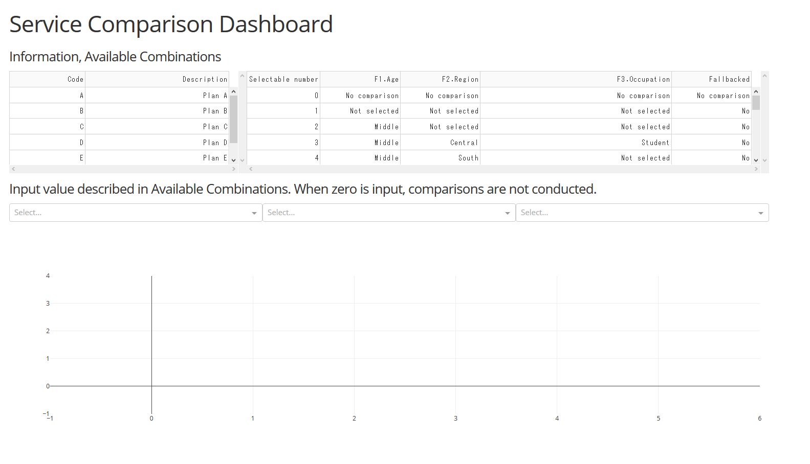
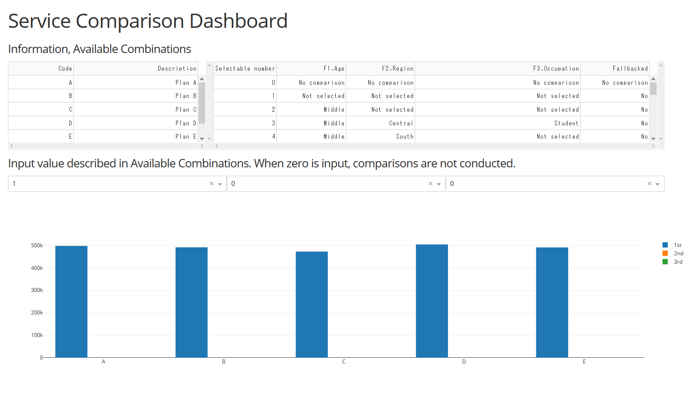
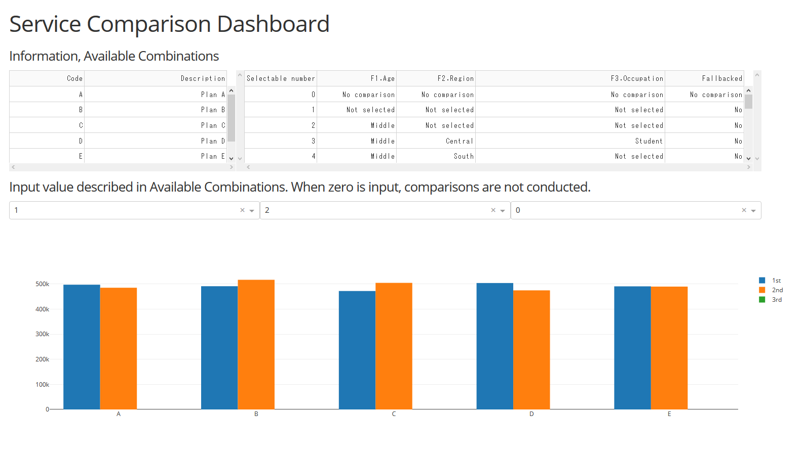
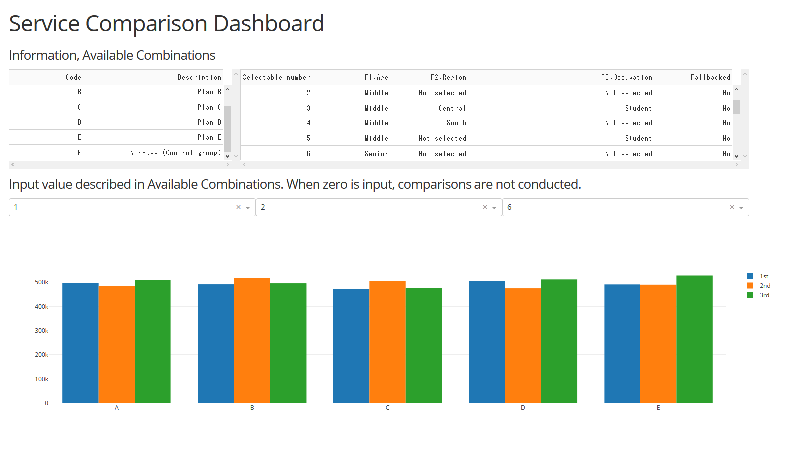

# Pythonによる技術の棚卸し #
成果物（2020/1/1時点）は以下のとおりです。各々の詳細は、該当のMarkdownを参照してください。

文体を次のように統一しています。
* 敬体：本ドキュメント
* 常体：各成果物のMarkdown

### 実行手順
実行環境にAnaconda3, PyCharm, R, RStudioがインストールされていることを前提とします。

PyCharmでリポジトリのクローン先となるプロジェクトフォルダを作成します。プロジェクトフォルダ名とリポジトリ名とを揃えておくと便利です。作成後RStudioによって、PyCharmのプロジェクトフォルダと同名のProjectを作成します。Rprojファイルがあるディレクトリをワーキングディレクトリとして認識します。

クローン先を用意した後、以下の手順を実行します。
* Gitを使用の場合：作成したクローン先プロジェクトフォルダを、一度他のディレクトリに移動してから、クローン先のディレクトリにおいて`git clone`コマンドを実行します。Sourcetree等のGUIクライアントでも同機能があります。実行後、移動済クローン先プロジェクトフォルダに残っているものを、`git clone`したリポジトリの直下に移動します。なお、`.gitignore`は`git clone`したものを正とします。
* そうでない場合：`Clone or download`の`Download ZIP`をクリックし、クローン先のディレクトリに展開します。  

Pythonのライブラリで足りないものを、あらかじめインストールします。

### 1.propensity_score_analysis
Rで実装した「サービス比較システム」をPythonに移植したものです。本システムの特色は次の2点です。
1. 一般化傾向スコア分析によるサービス導入効果の予測
1. Dashによるサービス比較の容易化

R版と同様、設計と実装にあたって、次の事項を想定しています。

##### シーズ
1. 効果を正しく推定するため共変量調整※が必要であるが、共変量数と組合せの数は指数関係にあること  
※介入群（例：サービス利用者）と対照群（例：非利用者）とで共通に得られる変数を両群で不偏にすること
1. レポーティングにおいて、ExcelといったOSに依存しがちなOfficeスイートに拠ると、シームレス化や大規模データ処理が難しいこと

##### ニーズ
1. 早急に予想を知り戦略のアウトラインを大まかに書くこと
1. 2種類以上のサービスの優先順位が付けがたく、慎重を期したいこと
1. ターゲット（年代、居住地方、職業等の属性）別にメリット最大化できそうなサービスの目星
1. 複数属性（例えば若年×東日本×学生）に有効なサービスの予想

#### 移植先
`estimation.py`と`rendering.py`の2つであり、Rで実装したサブルーチンのうち次のものを移植しています。

##### `estimation.py`
* 一般化傾向スコアの推定
* 逆確率重み（IPW）の計算
* IPW推定量の計算
* 縮退時、一般化線形モデルによるサービス導入効果の推定

##### `rendering.py`
Shiny Dashboardによるサービス比較と可視化であり、Pythonに移植するときDashを代用しています。

データ構造仕様とフローチャートは概ね、R版サービス比較システムと同様です。R版サービス比較システムの詳細は下記URLのとおりです。  
https://github.com/taiyoutsuhara/portfolio-r/blob/master/1.propensity_score_analysis/readme_ja.md

一般化傾向スコア推定用整形済データと分割済データの用意は、次の手順によります。
1. "/portfolio-python/1.propensity_score_analysis/"配下に"data_format_fst"フォルダと"data_format"フォルダを新規作成します。
1. "/portfolio-r/1.propensity_score_analysis/"配下の`00_main.R`において、先頭から`01_dataformat.R`までを行選択し実行します。
1. "/portfolio-r/1.propensity_score_analysis/dataformat/"配下に出来上がったfstファイルを、"/portfolio-python/1.propensity_score_analysis/data_format_fst/"配下にコピーします。
1. "/portfolio-python/1.propensity_score_analysis/"配下の`convert_fst_to_csv.R`で、整形済データの形式をfstからcsvに変換します。出力先は"/portfolio-python/1.propensity_score_analysis/data_format/"です。

#### Dashのイメージ
起動時の画面は以下のとおりであり、次のコンポーネントを含みます。
* Information：各サービスの概要
* Available Combinations：選択可能パターン表。この例では比較したい属性の番号（Selectable number）、年代、居住地方、職業、縮退の有無がまとまっています。"No comparison"は比較なし、"Not selected"は該当属性による分析データ分割がないことを意味します。
* 選んだ属性別予測結果のグラフ

入力ボックスにSelectable numberを入力すると、属性（年代、居住地方、職業）間で比較できます。上限は3種類です。使用例として、メリット最大化できそうなサービス戦略の目星を、属性別に付けていくことが考えられます。

属性を分けないとき（全体、Selectable number = 1）の分析結果だけ見たい場合を想定します。このときの使用例として、年代、居住地方、職業のいずれにも依存しそうにないサービス※戦略の選定が挙げられます。  
※このようなサービスは、希有ではないかと推測します。

次に、中年層（Selectable number = 2）をターゲットとしたとき、メリットを最大化できそうなサービス戦略の予想を想定します。下のように、メリット最大化できそうなサービスが、全体と中年層とで異なっていることが判ります。

最後に、中年層と老年層（Selectable number = 6）とで、サービス戦略を変えた方が良いのかどうか判断に迷っている場合を考えてみます。下のグラフより今回は、サービス戦略を変えると若干プラスになると予想されます。


#### R版との相違
##### 途中のデータ出力ファイル形式
R版ではfstが使用されていますが、Python版ではいずれもcsvによります。なお、Gitのファイル追跡から途中のデータ出力を外しています。

##### グラフ描画用データフレームの構造
R版は`spec.data_frame_for_ggplot2.csv`のとおりですが、Python版は辞書型であり、以下のkeyと要素を含んでいます。

グラフ用描画データ形式はリストであり、サービスの種類はN次元配列（ndarray）です。
```
{'x': サービスの種類（non-useを表すカテゴリを除外）,
'y': グラフ用描画データ[比較したいデータの選択可能番号][範囲],
'type': 'bar', 'name': 比較用序数（'1st', '2nd' or '3rd'）}
```

##### ダッシュボードの画面構成
* R (Shiny Dashboard) 版：複数ページ
* Python (Dash) 版：単一ページ